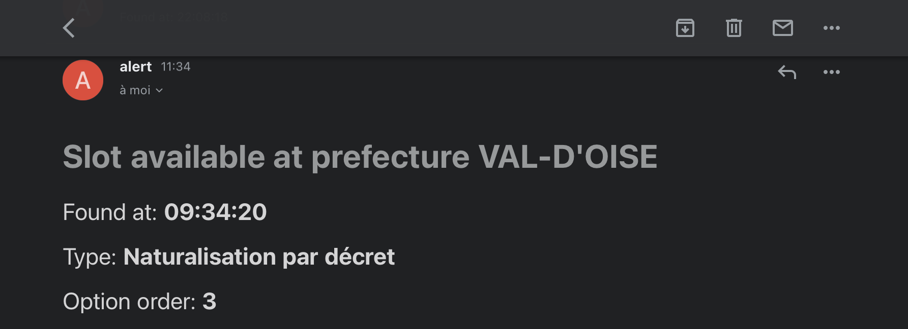
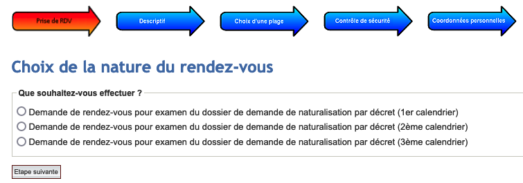
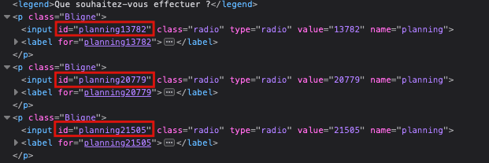

# Vite Mon Visa

This tool will notify users if an appointment is available in a prefecture


# Supported prefectures
This tool currently supports the following prefecture
- Val d'Oise

To add support for more prefectures, please refer to the prefecture configuration

# Prerequisites
This tool uses `Selenium` to be able to scrape and function. You will need a web browser binary installed on your machine, make sure you have `Firefox` installed

**(*)Chrome will be supported in the future**

# Deployment
## Docker
```
docker run -d --name <app_name> --env-file <env_file_path> hongphuc95/vite-mon-visa
```
To configure the environment file please refer to the `Configuration` section in this documentation

## Run the project locally
To launch this project on your local machine, execute these commands below:
```
python3 -m venv venv
source ./venv/bin/activate
pip install -r requirements.txt
python app.py
```

# Configuration
## Environment variables
The following configurations are optional. You can either use `.env` file or set environment variables manually

To enable notifications via email, set these environment variables below
```
EMAIL_NOTIFY_ENABLED=true
SENDGRID_EMAIL=<your_destination_email>
(optional) SENDGRID_SENDER=<sender_address>
(optional) SENDGRID_API_KEY=<api_key>
```
In case you want to set up the sender email using your own domain, you can do so by providing the sender email address and the Sendgrid API key value

To enable notifications via SMS with sendwithses, set these environment variables below
```
SMS_NOTIFY_ENABLED=true
SMS_API_KEY=<token>
SMS_TO_NUMBER=<your_phone_number>
(optional) SMS_FROM_NUMBER=<sender_number>
(optional) SMS_SID=<sender_id>
```

To configure the log's path, set the desired path like following
```
LOG_PATH=<log_path>
REFRESH_TIME=<request_refresh> # Default to 5 minutes
ENGINE=<browser_engine> # Will be supported in the future, default to Firefox
```

# Notification
## Email notification
If the tool is able to detect a slot available, you will receive an email like the image below containing the time, the type of request and the order of the planning in the list




## Prefectures list (Advanced)
To tell the tool what prefecture needed to be monitored, modify the list of prefectures in the `prefectures.json` file using the template below
```
{
 "url": <reservation_url>,
 "desk_ids": <planning_or_desk_id>, # Look up manually by inspecting the code source,
 "warning": <warning_rules_page>, # Extra warning with rules page depends on perfectures
 "operation_name": <operation_name>,
 "prefecture_name": <prefecture_name>,
 "appointment_name": <appointment_name>,
}
```
To identify all the `desk_ids` available, open the prefecture site in your browser and head to the planning selection, it would look like this



Then we can inspect the code source to retrieve the `desk_id` associated with each planning



**(*) We recommend spinning up this tool with 1 to 3 prefectures. The more prefectures you add up in the list, the more chance your IP address is likely to get blacklisted**

# Automated reservation (beta)
The visa reservation can be done automatically for the Val d'Oise prefecture for the time being. You need to set the following parameters
```
AUTO_RESERVATION=true
CAPTCHA_API_KEY=<2captcha_api_key> # Captcha solving service api key

FIRST_NAME=<first_name>
LAST_NAME=<last_name>
EMAIL=<personal_email>
PHONE_NUMBER=<phone_number>
ENTRY_DATE=<entry_date_in_france>
NATIONALITY=<nationality>
ZIP_CODE=<resident_zip_code>
```

The tool will select the most recent available date to book. Then it'll try to bypass the captcha using the 2captcha service and fill the formular containing your personal information required by the prefecture

You should receive an email from the prefecture confirming the reservation if this process worked